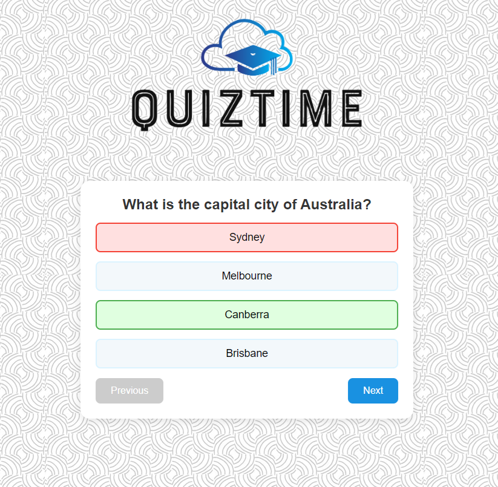

# HireUp - Quiz App Challenge

This is a simple single-page quiz application, with requirements set by a challenge on [HireUp](https://www.usehireup.com/):

**Objective:** Create a simple quiz application that displays a set of questions with multiple-choice answers. The quiz should be interactive and responsive, adapting to different screen sizes (desktop, tablet, mobile).

**Requirements:**

**Single HTML file:** All code (HTML, CSS, and JavaScript) must be contained within a single .html file.

**Quiz Structure:**
- Display one question at a time with 3-4 multiple-choice answers.
- Users should be able to navigate between questions using "Next" and "Previous" buttons.
- Include a "Submit" button at the end to see the final score.

**Interactivity:**
- Highlight the selected answer.
- Show feedback (correct/incorrect) after an answer is selected.
- Display the user's total score at the end of the quiz.

**Responsiveness:**
- The layout should be responsive, with questions and options adapting to different screen sizes.
- Use CSS Flexbox or Grid for layout.

**Styling:**
- Add basic styling to make the quiz visually appealing.
- Use CSS media queries to ensure the quiz looks good on both mobile and desktop devices.

**Submission:** Submit a single .html file containing your solution.

## Table of contents

- [Overview](#overview)
  - [Screenshot](#screenshot)
  - [Links](#links)
  - [Built with](#built-with)
- [Author](#author)

## Overview

The quiz app uses basic HTML/CSS/JS to generate a 4 question quiz. You can navigate between questions within the quiz, and your score is displayed at the end. You can also restart the quiz with 4 new random questions.

### Screenshot

### Links

- Live Site URL: [GitHub Pages URL](https://richardzhang01.github.io/simple-quiz-app/)

### Built with

- Vanilla HTML/CSS/JS
- flexbox

## Author

- Linkedin - [@RichardZhang](https://www.linkedin.com/in/richard-zhiyuan-zhang/)

